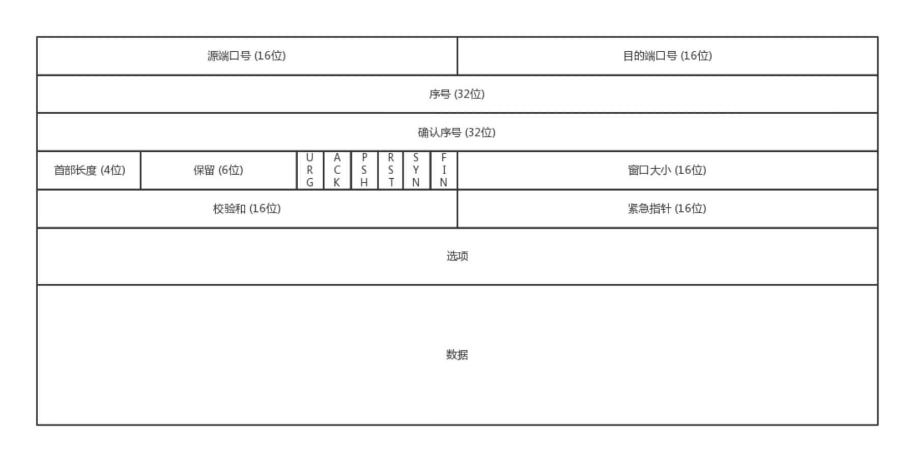
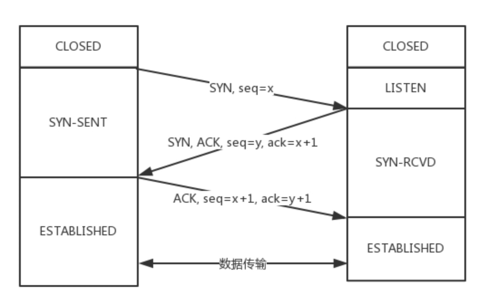
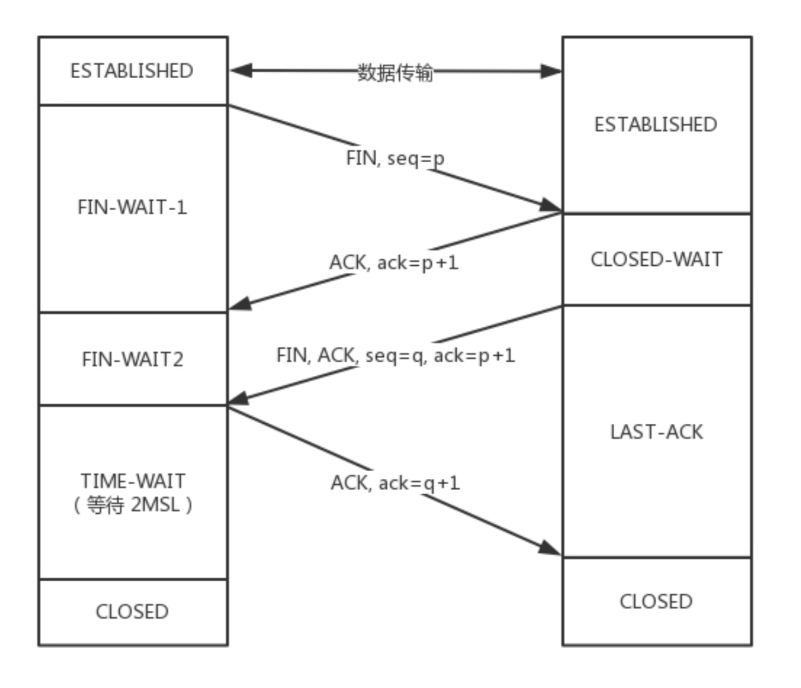
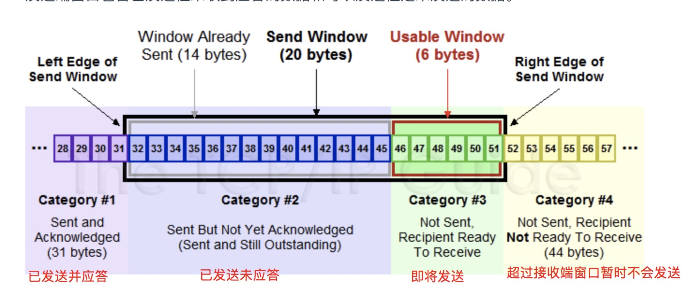
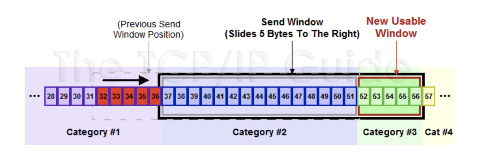

# TCP vs UDP
## TCP
- 面向连接的
- 保证数据无差错、不丢失、不重复、按序到达
- 拥塞控制
- 面向字节流

## UDP
- 面向无连接
- 不保证不丢失，也不保证按序到达
- 基于数据报，一个个发一个个收

# UDP协议
UDP协议报头很简单：

## UDP使用场景
- 网络好，对丢包不敏感的应用
- 不需要一对一建立连接，可以广播的应用，比如DHCP协议分配IP就是通过UDP
- 处理速度快，时延低，可以容忍少数丢包，即使网络拥塞也不退缩（不需要拥塞控制），比如直播  
  - TCP会各种重传啊，保证顺序啊，前面的不收到，后面的没法处理啊。不然等这些事情做完了，时延早就上去了。
  - TCP 在网络不 好出现丢包的时候，拥塞控制策略会主动的退缩，降低发送速度，这就相当于本来环境就差，还自断臂膀，用户本来就卡，这下更卡了

## 基于UDP的场景
### QUIC
全称Quick UDP Internet Connections，快速 UDP 互联网连接，谷歌提出的一种基于UDP改进的通信协议，目的是降低网络通信延时。**QUIC是作用于应用层的**，会自己实现快速连接建立、减少重传时延，自适应拥塞控制
### 直播
### 实时游戏
### IoT，谷歌推出了物联网通信协议 Thread
总之，UDP 虽然简单，但它有简单的用法。它可以用在环境简单、需要多播、应用层自己控制传输 的地方。例如 DHCP、VXLAN、QUIC 等

# TCP协议

TCP协议的报头复杂多了：

## 三次握手
请求——应答——应答之应答
### 为什么不两次握手呢
A发送了请求后，B发送了应答，应答有可能丢失，A有可能已经消失，所以两次握手B不能确定应答建立
### 为什么不四次握手
应答之应答也有可能丢失，但是这样下去就没完没了了，及时100次握手也不能保证真的可靠。  
及时A发送的应答丢失了，当连接建立后A发送的数据到达B后，B就会认为连接建立。如果B挂了，A发送的数据会报错，A也会知道B出事了
**三次握手除了建立连接外，还确定了TCP包的起始序号**
### 状态码
TCP标志位有6中标识：
- SYN：建立连接
- ACK：确认
- FIN：结束
- RST：重置
- URG：紧急
- PSH：传送
- seq number: 序号
- ack number: 确认序号

  

图中小写`seq,ack`应为`seq number`、`ack number`
1. 第一次握手，主机A发送`SYN=1`，随机产生`seq number = x`，发起建立连接请求
2. 第二次握手，主机收到请求后进行确认，发送`SYN=1，ACK=1,ack number=x+1`,随机生成主机B的`seq number=y`
3. 第三次握手，主机A检查收到的`ack number`是否正确，即第一次的`seq number+1`,以及`ACK`是否为1，若正确，主机A会再发送`ack number=(主机B的seq+1)，ACK=1`，主机B收到后确认seq值与ACK=1则连接建立成功

## 四次挥手

### 为什么需要 `TIME-WAIT` 2MSL时间
担心最后一次`ACK`包对方没有收到，那么对方在超时后会发送第三次的 `FIN`包，被动关闭端接到重发的FIN包后可以再发一个ACK应答包

## ARQ
超时重传机制
- 停止等待ARQ：接收到应答才发送下一个包
- 连续ARQ：
  在连续 ARQ 中，发送端拥有一个发送窗口，可以在没有收到应答的情况下持续发送窗口内的数据，这样相比停止等待 ARQ 协议来说减少了等待时间，提高了效率。

TCP为了保证包的顺序性，每个包都有一个ID（头部的序号），上面提到的 `seq number`，为了保证不丢包对发送的包都要进行应答，如果发送端超过一定的时间没有收到应答，客户端就会重新发送这个包，直到有应答。

## 累计应答
在连续ARQ中，接收端会不断收到报文，如果和停止等待ARQ一样接受一个报文应答就发送一个应答太浪费资源，通过累计应答，接收端接受多个报文后统一回复一个应答。报文中的 ack 可以用来告诉发送端这个序号之前的数据已经全部接收到了，下次请发送这个序号 + 1的数据

## 滑动窗口
在 TCP 中，两端都维护着窗口：分别为发送端窗口和接收端窗口。

发送端窗口包含已**发送但未收到应答的数据**和**即将发送的数据（可以发送但未发送）**

**发送窗口的大小由接收窗口的剩余大小决定的。接收方会把当前接收窗口的剩余大小写入应答，发送方根据这个值和网络拥塞情况设置发送窗口大小，所以发送窗口是在不断变化的。**  
当发送方收到应答，会随之将窗口进行滑动，滑动窗口实现了**流量控制**，接收方通过应答告知发送方还可以发送多少数据，从而保证接收方能来得及处理。  
  

当极端情况，发送窗口大小变为0的时候，发送端会定时发送窗口探测数据包，看是否可以调整窗口大小。当接收方处理比较慢时，要防止低能窗口综合征，别空出一个字节就告诉发送端，然后立刻又被填满了。可以当窗口太小的时候不更新窗口，直到达到一定大小或者达到缓冲区一半再更新窗口。
## 拥塞控制
### 慢启动
1. 一开始拥塞窗口设为1，每次收到应答后拥塞窗口乘以2，拥塞窗口成指数增长
2. 当达到一个阈值后，拥塞窗口大小每次只加1，变成指数增长

### 拥塞避免
当传输中发生丢包超时时，TCP会认为网络发生拥塞，会进行以下操作：
- 阈值变为当前拥塞窗口的1/2
- 拥塞窗口变为1
- 重新启动慢启动

### 快速重传
有时发生丢包超时并不是网络拥塞，有可能就是异常丢失。比如接收端收到失序的报文，接收端只会回复最后一个顺序正确的报文序号，发送端收到三个重复ACK后会快速重传，不需要等到超时重传。
### 快速恢复
当发生快速重传后：
1. 拥塞窗口变为原来1/2
2. 阈值变为拥塞窗口大小（变为一半后的大小）
3. 拥塞窗口每次变为 + 1