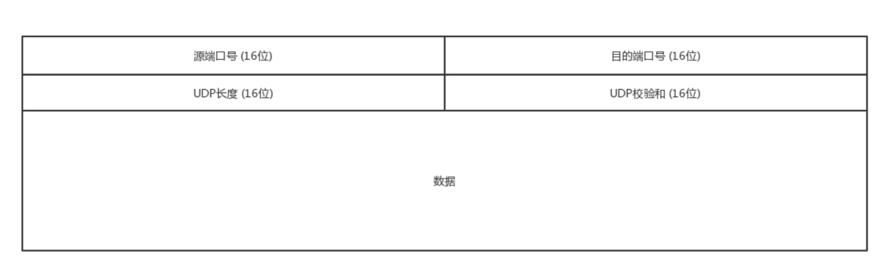

# TCP vs UDP
## TCP
- 面向连接的
- 保证数据无差错、不丢失、不重复、按序到达
- 拥塞控制
- 面向字节流

## UDP
- 面向无连接
- 不保证不丢失，也不保证按序到达
- 基于数据报，一个个发一个个收

# UDP协议
UDP协议报头很简单：

## UDP使用场景
- 网络好，对丢包不敏感的应用
- 不需要一对一建立连接，可以广播的应用，比如DHCP协议分配IP就是通过UDP
- 处理速度快，时延低，可以容忍少数丢包，即使网络拥塞也不退缩（不需要拥塞控制），比如直播  
  - TCP会各种重传啊，保证顺序啊，前面的不收到，后面的没法处理啊。不然等这些事情做完了，时延早就上去了。
  - TCP 在网络不 好出现丢包的时候，拥塞控制策略会主动的退缩，降低发送速度，这就相当于本来环境就差，还自断臂膀，用户本来就卡，这下更卡了

## 基于UDP的场景
### QUIC
全称Quick UDP Internet Connections，快速 UDP 互联网连接，谷歌提出的一种基于UDP改进的通信协议，目的是降低网络通信延时。**QUIC是作用于应用层的**，会自己实现快速连接建立、减少重传时延，自适应拥塞控制
### 直播
### 实时游戏
### IoT，谷歌推出了物联网通信协议 Thread
总之，UDP 虽然简单，但它有简单的用法。它可以用在环境简单、需要多播、应用层自己控制传输 的地方。例如 DHCP、VXLAN、QUIC 等

# TCP协议

TCP协议的报头复杂多了：

## 三次握手
请求——应答——应答之应答
### 为什么不两次握手呢
A发送了请求后，B发送了应答，应答有可能丢失，A有可能已经消失，所以两次握手B不能确定应答建立
### 为什么不四次握手
应答之应答也有可能丢失，但是这样下去就没完没了了，及时100次握手也不能保证真的可靠。  
及时A发送的应答丢失了，当连接建立后A发送的数据到达B后，B就会认为连接建立。如果B挂了，A发送的数据会报错，A也会知道B出事了
**三次握手除了建立连接外，还确定了TCP包的起始序号**
### 状态码
TCP标志位有6中标识：
- SYN：建立连接
- ACK：确认
- FIN：结束
- RST：重置
- URG：紧急
- PSH：传送
- seq number: 序号
- ack number: 确认序号

  

图中小写`seq,ack`应为`seq number`、`ack number`
1. 第一次握手，主机A发送`SYN=1`，随机产生`seq number = x`，发起建立连接请求
2. 第二次握手，主机收到请求后进行确认，发送`SYN=1，ACK=1,ack number=x+1`,随机生成主机B的`seq number=y`
3. 第三次握手，主机A检查收到的`ack number`是否正确，即第一次的`seq number+1`,以及`ACK`是否为1，若正确，主机A会再发送`ack number=(主机B的seq+1)，ACK=1`，主机B收到后确认seq值与ACK=1则连接建立成功