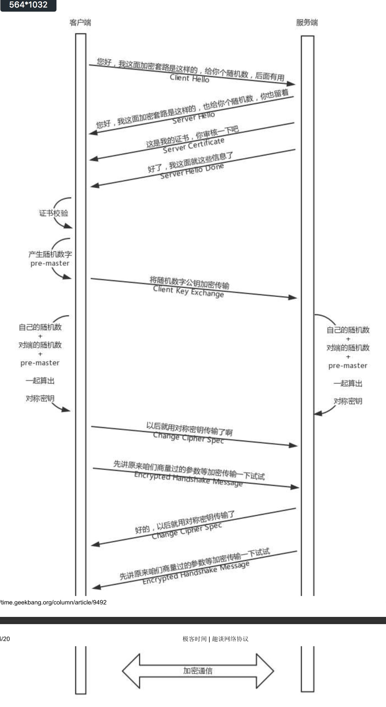

http报文分为三部分：
- 请求行|状态行
  请求行：URL、方法、http版本  
  状态行：状态、http版本、短语
- 首部
- 实体

# HTTP2.0
HTTP1.1存在队头阻塞问题
## 二进制传输
HTTP1.1中数据传输通过文本形式，现在会进行二进制格式编码

## Header压缩
- HPACK压缩格式对header进行编码减少体积
- 在两端建立索引表，已记录过的header只传key，不传value，减少体积

## 多路复用
### 流
一个 TCP 连接中可以发送多个请求，每个请求就是一个数据流
### 帧
每一个数据流又可以分为多个帧，帧代表着最小的数据单位，每个帧会标识出该帧属于哪个流

# HTTPS
## 对称加密
两遍拥有相同的秘钥，多可以加密解密
## 非对称加密
有公钥和私钥之分，公钥所有人都可以知道，私钥只能是分发公钥的人知道。用公钥加密，只能用私钥进行解密
## TLS
https还是通过http协议进行传输信息，但是信息通过TLS协议进行加密。  
TLS作用于传输层之上，应用层之下，TLS使用了对称加密和非对称加密。  
由于非对称加密性能比对称加密低，所以TLS握手阶段采用非对称加密获取秘钥，正式传输数据时利用之前获取的秘钥进行对称加密方式通信  
1. 客户端发送一个随机值，需要的协议和加密方式
2. 服务端收到客户端的随机值，自己也产生一个随机值，并根据客户端需求的协议和加密方式来使用对应的方式，发送自己的证书（如果需要验证客户端证书需要说明）
3. 客户端收到服务端的证书并验证是否有效，验证通过会再生成一个随机值，通过服务端证书的公钥去加密这个随机值并发送给服务端，如果服务端需要验证客户端证书的话会附带证书
4. 服务端收到加密过的随机值并使用私钥解密获得第三个随机值，这时候两端都拥有了三个随机值，可以通过这三个随机值按照之前约定的加密方式生成密钥，接下来的通信就可以通过该密钥来加密解密

